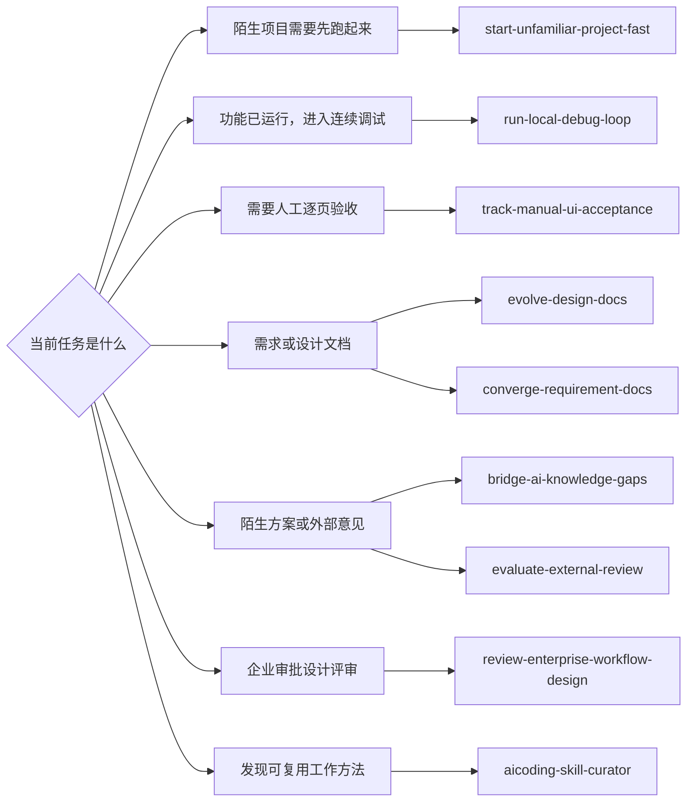

# aicoding

一个持续演进的 AI 编程经验库。

这里不收集具体项目资料，而是从真实开发过程中提炼可以跨项目复用的经验：需求澄清、领域建模、软件设计、编码协作、验证方法，以及人与 AI 共同工作的纪律。

## 给 Agent 的入口

把本仓库目录作为经验库提供给 Agent 即可。Agent 应先读取根目录 [AGENTS.md](AGENTS.md)，再根据当前任务选择所需 Skill 或经验文章。

访问权限采用安全默认值：

- **只读使用（默认）**：引用本仓库辅助其他工作时，只能读取和应用，不能修改本仓库。
- **经验库维护**：只有用户明确说明当前会话专门维护、整理或演进本仓库时，才允许修改。

仅提供目录、要求参考、调用 Skill 或发现内容可改进，都不等于获得写权限。

### 能力索引

| 场景 | 使用入口 |
| --- | --- |
| 图解需求细节、字段与公式，核验陌生方案并明确待确认选择 | `skills/bridge-ai-knowledge-gaps/SKILL.md` |
| 功能主体完成后保持本地环境可用，持续联调、修复与验证 | `skills/run-local-debug-loop/SKILL.md` |
| 为多页面、多角色功能建立人工验收进度清单 | `skills/track-manual-ui-acceptance/SKILL.md` |
| 快速启动陌生项目，避免逐错试错和重复全量构建 | `skills/start-unfamiliar-project-fast/SKILL.md` |
| 评审企业审批、OA/BPM 需求与原型，纠正概念混维和平台痕迹 | `skills/review-enterprise-workflow-design/SKILL.md` |
| 创建或持续演进人类可读的需求与设计文档 | `skills/evolve-design-docs/SKILL.md` |
| 清理发散讨论残留，形成可开发的当前基线 | `skills/converge-requirement-docs/SKILL.md` |
| 独立核验其他评审者或模型的意见 | `skills/evaluate-external-review/SKILL.md` |
| 判断新经验是否值得沉淀为 Skill | `skills/aicoding-skill-curator/SKILL.md` |

Agent 只应加载与当前问题有关的最少内容。仓库经验提供判断框架，不能替代当前任务的正式需求、真实代码和验证结果。



## 内容原则

1. **通用化**：公开内容不依赖某个项目背景才能理解。
2. **可验证**：明确区分事实、推断、建议和假设。
3. **持续修订**：发现新证据时更新既有结论，不保留互相冲突的过时口径。
4. **经验优先**：记录判断方法、适用条件和失败模式，而不是项目流水账。
5. **公开安全**：任何项目名称、路径、原文、代码、截图、日志和数据都不进入 Git。

## 仓库结构

```text
notes/       可公开的通用经验
skills/      可被 Agent 直接执行的工作方法
scripts/     内容安全与质量检查
.local/      本地观察状态和项目证据（Git 忽略）
```

## 当前主题

- [从需求讨论收敛到开发基线](notes/从需求讨论收敛到开发基线.md)
- [ER 优先的文档演进方法](notes/ER优先的文档演进方法.md)

## 经验沉淀流程

```text
真实项目观察
    ↓ 仅存本地 .local/
事实与假设分离
    ↓
去项目化与抽象
    ↓
形成可复用经验
    ↓
检查后进入 Git
```

详细纪律见 [CONTRIBUTING.md](CONTRIBUTING.md)。
