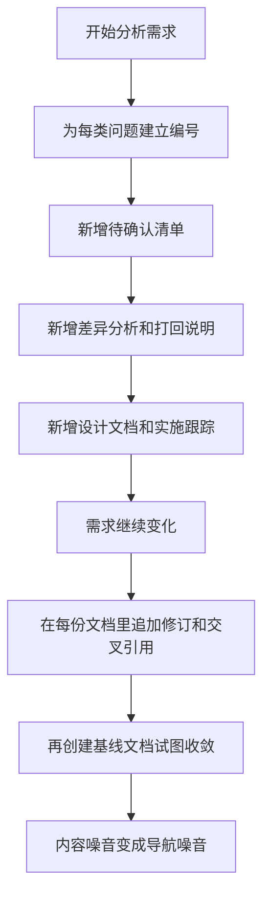
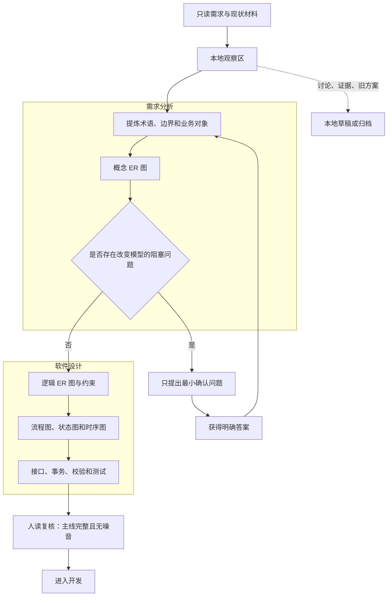
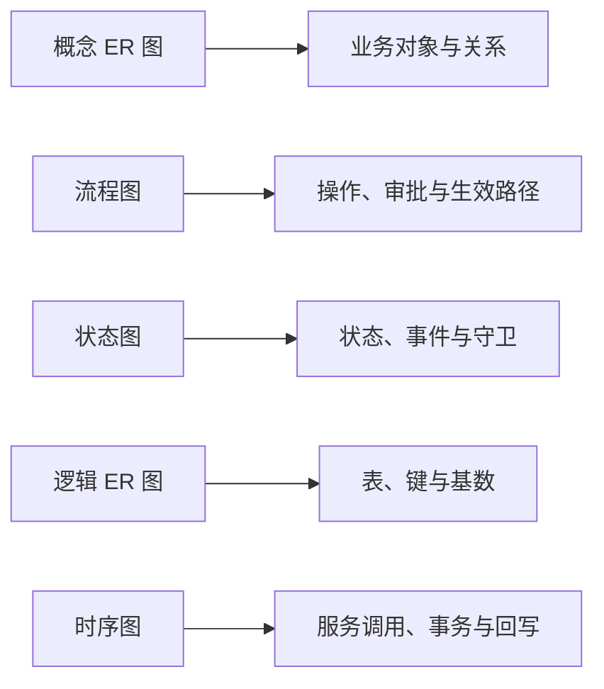

# ER 优先的文档演进方法

## 1. 结论

软件设计文档的首要职责，是帮助人建立完整、稳定、可执行的系统认知。文档不应成为分析过程、对话记录、任务进度和历史方案的混合存储。

对于习惯通过 ER 图理解业务的人，更重要的是保持稳定的思考顺序：先在需求分析中用业务定义和概念 ER 图澄清对象，再进入软件设计展开逻辑模型、处理流程、接口和测试。这个顺序不限定必须使用一份还是多份文档。


已经确认的答案应直接写回负责该事实的文档；被推翻的方案从当前有效内容中移除，而不是继续与现行方案并列。文档数量可以按稳定职责划分，但同一事实只能有一个当前定义。

## 2. 文档为什么容易越写越乱

常见的失控过程如下：



表面原因是文件太多，根因通常是以下职责没有分开：

| 混入当前有效文档的内容 | 造成的后果 |
| --- | --- |
| 对话与推理过程 | 读者必须重复经历作者的思考才能得到结论 |
| 被推翻的方案 | 新旧口径并列，无法判断当前有效规则 |
| 待确认问题的全部分支 | 问题数量膨胀，真正阻塞开发的决策被淹没 |
| 代码分支、提交和进度 | 设计文档迅速过期，并与任务管理职责重叠 |
| 多套问题编号 | 阅读依赖记忆编号和跨文件跳转，认知负担增加 |
| 概念模型与物理表混画 | 需求假设过早固化为数据库结构 |

## 3. 这类过程中的典型不合理动作

### 3.1 用文档保存 AI 的工作记忆

AI 为避免丢失上下文，容易不断创建分析、清单、决策、状态和归档文档。这样有利于机器继续工作，却不利于人阅读。

改进原则：

> 分析过程进入本地草稿；只有经过归纳的当前结论进入对应的正式文档。

### 3.2 一开始就追求问题清单完整

逐字段穷举问题会产生大量可以由常规设计安全解决的细节，导致评审对象从“关键业务决策”变成“所有可能性”。

更好的判断标准是：只有答案不同会改变业务对象、数据模型、核心算法或不可逆数据策略的问题，才需要外部确认。

### 3.3 在概念未稳定前展开物理表设计

概念 ER 图用于发现业务对象和关系；逻辑或物理 ER 图用于实现。当两者过早合并，页面字段、低代码子表和临时状态会被直接固化为实体和列。

### 3.4 决策完成后只更新“决策记录”

如果答案留在独立决策表中，而需求分析或软件设计仍保留原问题和旧口径，读者必须自行合并多个来源。

正确动作是：

1. 先改负责该事实的需求分析或软件设计，使正文只剩当前口径；
2. 再在修改历史中用一句话说明变化；
3. 只有不可逆或反直觉决策才另留简短理由。

### 3.5 用形式化分层代替自然思考顺序

需求分析、软件设计和决策可以分文档保存，问题不在“多文档”本身，而在于按产物名称机械分层，却没有保持清晰的阅读顺序和事实归属。读者因此需要在多份文件之间拼装同一个结论。

文档结构应服务维护者稳定有效的认知方式，而不是追求形式上的完整。

## 4. 推荐的文档演进过程



### 阶段一：建立骨架，不急着写满

先确定文档地图：需求分析负责什么，软件设计负责什么，临时问题和实施进度放哪里。每类事实只指定一个维护位置，此时不急于创建决策清单、差异清单或物理表全集。

### 阶段二：ER 图驱动需求分析

先画概念 ER 图，只表达业务对象、关系和基数。每画出一个实体，都问：

- 它是否脱离当前页面仍然存在？
- 它有独立生命周期吗？
- 它的唯一性是什么？
- 它是事实、单据、快照，还是展示结构？

无法回答的问题直接标在 ER 分析附近，不建立跨文档编号体系。

### 阶段三：压缩确认问题

将同一根因的多种表现合并成一个问题。确认后立即修改术语、ER 图和规则正文，并删除问题描述。

需求分析最多保留一个很短的“当前未决”小节，而且其中只能出现真正阻塞模型或算法的问题。

### 阶段四：从概念模型进入软件设计

概念稳定后，再补逻辑 ER 图、表约束、状态机、业务流程和关键调用时序。设计应从前面的业务对象自然推导，而不是重新建立另一套叙事。

### 阶段五：实现与验证

接口、服务、事务边界和测试场景写入软件设计。开发进度、分支名、提交记录和临时待办放到任务系统或本地状态，不写入设计正文。

### 阶段六：每轮变化都重写当前态

需求变化时，直接更新当前章节和 Mermaid 图。修改历史只记录“什么发生了变化”，不要增加“某版本调整”章节堆在文末。

## 5. 适合 ER 思维的文档组合

```text
模块目录/
├── 01-需求分析.md
│   ├── 目的、范围与来源
│   ├── 术语与业务边界
│   ├── 概念 ER 图
│   ├── ER 分析结论
│   ├── 核心业务规则
│   └── 当前未决（可选，保持极短）
├── 02-软件设计说明.md
│   ├── 总体设计与模块职责
│   ├── 逻辑 ER 图
│   ├── 表、字段、约束和索引
│   ├── 流程图、状态图和关键时序图
│   ├── 服务、事务、接口和权限
│   └── 测试、迁移与实施说明
└── 归档/
    └── 必须保留的旧资料
```

这只是符合“先 ER 需求分析，再软件设计”过程的一种划分。也可以继续拆出接口或测试文档，但必须按稳定职责拆分，并明确阅读顺序。归档不是日常阅读入口，也不应该被正式文档频繁引用。

## 6. Mermaid 的职责分工



使用 Mermaid 时遵守三条规则：

1. 一张图只回答一个主要问题；
2. 图后只写无法放进图里的约束和例外；
3. 图、表格和正文不重复承载同一批信息。

## 7. 正式文档的去噪标准

以下内容默认不进入需求分析和软件设计正文：

- 完整对话和推理过程；
- 已关闭问题及其所有备选答案；
- 被推翻的 ER 图和表结构；
- 为 AI 保持上下文而创建的编号体系；
- 分支、提交、工作树和临时实现状态；
- 同一规则的原文引用、转述和设计说明三重重复；
- “如果未来可能……”但当前没有明确需求的扩展设计。

每次整理后可以用三个问题检查：

1. 新开发者能否按明确顺序阅读，不进入归档就理解业务到实现？
2. 每个重要概念是否只有一个当前定义？
3. 删除任何一段后，如果理解没有损失，这段是否本来就是噪音？

## 8. AI 协作纪律

为了避免 AI 再次把文档推向复杂化，可以固定以下约束：

- 未经允许不新增文档；新增前必须说明它的稳定职责和阅读顺序。
- 允许需求分析与软件设计分开，但不得让同一事实在多份文件中分别维护。
- 讨论答案确认后，必须回写正文并删除旧问题，不只追加记录。
- 不以问题数量衡量分析质量；优先压缩为最小决策。
- 先给 Mermaid 和归纳结论，再补必要文字。
- 每次更新后主动检查重复、失效口径和跨文件跳转。
- 实施状态进入任务记录，不污染软件设计说明。

## 9. 文档拆分判断

文档数量不是质量指标。是否拆分取决于职责是否稳定：

- 需求分析负责业务对象、概念 ER 和业务规则；
- 软件设计负责逻辑模型、流程、接口和实现约束；
- 测试、迁移或接口规模足够大时，可以形成独立文档；
- 决策记录只保留无法从当前正文理解的关键理由；
- 进度跟踪不属于需求分析或软件设计。

无论拆成几份，都必须保留“需求来源 → ER 需求分析 → 软件设计 → 验证”的清晰顺序，并确保同一事实只有一个当前维护位置。
