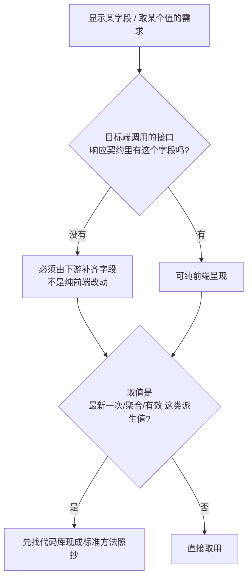

# 按数据链路决定改动落点

## 1. 结论

一个"在某界面显示某字段"或"取某个派生值"的需求，改动落在前端还是后端、用什么逻辑取值，取决于**事实上的数据链路**，而不是直觉。两类直觉最常出错：

- "这个只改前端就行" —— 前提是该字段已经在前端能拿到的接口里，未经核验不成立。
- "随手写个取最新的就行" —— 系统里往往已有算好这个值的标准方法，自造版容易漏边界、口径漂移。

因此定落点时先做两步核验：**数据是否可达** 与 **是否有现成取数逻辑可复用**。

其中第二条在**快速处理线上问题时尤其重要，也最容易违背**：时间越紧，越应该复用已被验证的现成逻辑，而不是自己另写一段。紧急上线恰恰是最没有时间充分测试新代码的时刻，此时自造逻辑埋进去的边界缺陷，代价最大。

## 2. 数据可达性：字段是否在目标端接口契约内

关键陷阱：**系统里存在这个数据，不等于当前这一端能拿到它。**

同一份数据常常同时挂在多个接口后面，而它们的可达性不同：面向管理端的接口通常带鉴权、字段更全；面向终端用户的查询接口往往免登录、字段是裁剪过的子集。需求要展示的位置决定了走哪条接口，也就决定了能不能拿到目标字段。

判断步骤：

1. 找到**目标端实际调用**的那个接口（不是"系统里有哪个接口能查到"）。
2. 看该接口响应契约（VO/DTO）里**有没有**这个字段。
3. 没有 → 纯前端做不到，必须由返回该接口的一方补齐字段；此时"只改前端"是错误结论，应尽早向提出方说清并给出后端改动方案。

**失效边界**：若目标端接口本就返回该字段（或能通过它已返回的数据在前端算出），那确实可以只改前端——先核验，别默认。

## 3. 取派生值：复用现成标准方法，别自造

取"最新一次""合计""当前有效"这类派生值时，先在代码库里找**已被多处复用**的现成方法，照抄或直接调用，而不是就地写一段 `reduce`/`max`/取末位。

**越是快速处理线上问题，越要优先复用已有逻辑，而不是自己写。** 紧急时的直觉是"自己写一段最快"，但已被验证的现成实现往往既更快又更稳：省去自己趟边界的时间，也避免在紧急上线里引入新坑。时间压力越大，越应该先找现成实现，而不是另起炉灶——自造代码恰恰是最没时间充分测试的那一刻写下的。

现成方法值得优先的两个理由：

- **它通常已覆盖你没想到的边界。** 例如"取最新一次某事件"的正规实现，往往还判断了"该事件之后若又发生了对应的撤销/回退事件，则视为无效"。自造版只会取到那条最新记录，得出错误结论。
- **口径与系统其它位置一致。** 同一个派生值若在多个页面各写各的，迟早漂移。复用同一方法保证到处口径相同。

自造实现的两个常见坑：

- **漏边界**：只处理了正常路径，忽略撤销、回退、失效等反向事件。
- **依赖隐含顺序**：如"取列表最后一条"依赖上游恰好按时间排序。当下也许成立，但这是隐含耦合，上游排序一改就悄悄错。要么显式按目标维度取极值，要么直接复用不依赖调用方的现成方法。

**失效边界**：复用前要确认现成方法的**语义正好是你要的**——否则照抄会连它的口径一起带错。语义不完全一致时，参照它的边界处理，另写一个而不是硬套。

## 4. 落点核验清单

- 目标端调用的接口，响应里有没有这个字段？没有就不是纯前端改动。
- 要展示的数据，是不是挂在一个当前这一端够不到的（如需鉴权的）接口上？
- 取的是派生值吗？代码库里有没有算这个值的现成方法？
- 现成方法有没有处理撤销/回退/失效等反向情形？我的场景需不需要同样处理？
- 我的取值有没有偷偷依赖"列表恰好按某顺序返回"？

---

*署名：范显*
