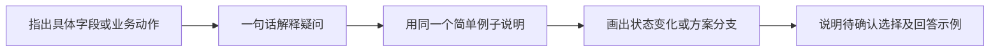

# Bridge AI Knowledge Gaps

处理“AI 看似知道、用户暂时无法独立判断”的知识不对称。目标不是让用户先学会全部技术，也不是替用户暗中拍板，而是把陌生结论转成可以理解、核对和逐步验证的决策。

## 职责边界

- 用户负责业务目标、风险偏好和最终取舍；AI 负责调查、解释、提出方案并提供证据。
- 代码、运行结果、正式需求和权威文档是事实来源；模型语气、另一模型的赞同和既有总结都不是证据。
- 能通过只读检查、代码检索或小规模验证解决的问题，由 AI 主动查清，不反抛给用户。
- 只有会改变业务行为、风险边界或投入范围的选择，才请求用户决定。

## 判断流程

### 1. 确认事实源

先确定本次任务的权威来源及优先级，例如：用户明确决定、正式需求或原型、当前代码与运行结果、平台文档、历史分析。发现冲突时明确指出，不把多个来源折中拼接成新需求。

### 2. 标记认知状态

只对影响当前决策的关键结论分类：

- **共同已知**：双方都理解且有证据，可直接采用；
- **用户掌握的上下文**：AI 缺少业务事实，应请求最小补充；
- **AI 主张、用户未验证**：AI 必须用通俗语言解释，并给出可定位的依据、适用条件和可能反例；
- **双方未知**：不得脑补，选择成本最低的调查、实验或纵向切片。

不要把“AI 主张”表述为“AI 已知”，除非已有外部证据支持。

### 3. 对新增设计设置复用门

当方案引入新抽象、新表、新状态、新流程或新框架时，先回答：

1. 它要满足的业务目标是什么；
2. 当前系统已经具备什么；
3. 现有能力缺少的最小差距是什么；
4. 为什么扩展现有机制仍不够；
5. 最小新增方案、验证方式和失败后的回退路径是什么。

如果现有能力可以等价满足，优先复用并说明与目标表现的差异。不能为了复用而降低已确认需求，也不能因为新方案更整齐就扩大范围。

### 4. 用验证替代信任

- 优先完成一条包含真实输入、核心逻辑、持久化或接口、界面以及验收断言的纵向切片，再横向铺开。
- 完成声明必须附带刚执行的验证证据；未验证时准确报告为“已实现，待验证”。
- 独立评审者或第二个模型只能提供检查线索，不能替代事实源和测试结果。
- 不为了消除所有理论未知而阻塞编码；可逆且验证成本低的实现细节允许在切片中确认。

## 输出方式

### 用户追问细节时

用户问“什么意思”“怎么回答”“哪个字段有疑问”时，默认按以下方式解释，深度随问题收缩：

- 先定位页面、字段或动作，再说明它影响的业务结果，不从问题代号或术语展开。
- 用一组标为示例的简单数字贯穿解释。公式写出单位、计算过程和结果；累计类问题区分已有数量、本次数量、计入时机和更正方式。
- 涉及流转、累计或多个选择时，优先用简短 Mermaid 图；相互独立的选择分开画。图后只补关键边界，不再完整复述图。
- 主动核算提供的例子。如果数字在另一种口径下成立，应指出口径差异，不沿用“怎么算都不对”等未经证实的结论，也不据此揣测设计者。
- 明确区分已确认规则与建议方案；建议画入图时标明“待确认”。不要把可选方案画成已定流程。
- 最后列出真正需要业务决定的最小选择；用户问“怎么回答”时给一段可转发的答复，并说明适用条件。实现一致性由开发解决，不仅为开发方便而增加业务限制。
- 用户只问某个字段或一句话含义时，直接短答；不要每次强制展开完整图解。解释请求本身不授权修改项目文件。

### 方案评审时

先用普通语言给出结论，再按需要补充：

- **依据**：结论来自哪里；
- **AI 推断**：哪些部分仍是解释或设计判断；
- **未知与影响**：还不知道什么，是否会导致返工；
- **下一步**：直接实施、先做纵向验证，或请求业务决定。

保持输出紧凑。不要用密集代号替代解释，不要求用户为了监督 AI 而先掌握整个技术领域。

## 停止条件

- 若缺失信息只影响实现细节，选择保守、可逆且符合现有惯例的方案继续推进。
- 若缺失信息会改变业务语义、数据兼容性、安全边界或不可逆操作，停止实施并提出一个最小问题。
- 若无法取得可靠证据，明确报告“无法验证”，不得用模型自信度填补。
