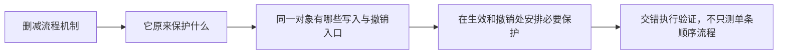

# Review Enterprise Workflow Design

从国内企业审批、OA/BPM 产品架构与工作流落地视角审查需求。目标不是照搬某个成熟产品，也不是让通用流程引擎的概念支配业务，而是在编码前得到业务人员能理解、对象关系正确、可由流程内核可靠实现的需求模型。

## 评审立场

- 原型是需求表达和验收依据之一，不默认其分类、命名和交互都正确。
- 用户已确认的业务语义优先于原型；正式需求优先于平台现状；现有代码只能证明已有能力，不能反向定义需求。
- 借鉴国内企业审批产品的常见范式，但没有可靠来源时不要声称某个具体产品一定如何实现。
- 先分清交付目标是单个业务，还是以业务为载体建设平台能力。单一示例没用到某能力，不等于该能力没有需求；平台范围以用户确认的能力目标为准，再选择代表性场景验证。不为未授权的“平台完整性”自行扩项。
- 优先复用稳定的流程内核，是否保留现有产品界面和配置模型要单独判断。

## 先建立最小概念模型

开始接口、表结构或页面设计前，至少区分以下对象：

- **模板与版本**：模板是可编辑配置；发布产生不可变版本，在途实例继续使用启动时版本。
- **流程实例**：一次业务申请或业务单据的运行过程。
- **节点**：模板中的处理步骤或路由结构。
- **任务**：需要某个人完成、且完成前会阻塞流程推进的运行时工作项。
- **抄送规则与抄送记录**：通知谁、何时通知及是否已阅；不阻塞流程。
- **操作与审计记录**：同意、退回、转办、作废、字段修改等已发生事实。

优先用概念 ER 表达归属与生命周期。若两个概念的生命周期、是否阻塞、状态或责任人不同，先拆成不同对象，不要因为原型放在同一个选择框就归为一类。

## 做维度正交检查

逐项确认配置属于哪个维度。纠正混维是重新组织语义，不是顺手删除能力；界面可以合并呈现，底层含义仍应可区分：

| 维度 | 回答的问题 |
| --- | --- |
| 节点行为 | 这是作出同意/退回判断，还是完成一项办理工作？ |
| 办理人来源 | 谁可能办理：指定人员、角色、组织、业务字段等？ |
| 多人完成策略 | 一人完成即可，还是所有人都要完成？ |
| 字段权限 | 当前节点可以看、改、必填哪些业务字段？ |
| 退回规则 | 可以退回哪里，退回后从哪里继续？ |
| 协作动作 | 是否允许转办；是否真的需要委派、加签等？ |
| 抄送与通知 | 通知谁、何时通知、是否需要已阅？ |
| 时限与升级 | 超时后提醒、升级还是自动处理？ |

特别检查这些常见混淆：

- 审批与办理是节点行为；不要把抄送并列为阻塞型“任务类型”。
- 抄送是旁路通知：维护接收人集合、触发时机和已阅记录，不参与审批结果。
- 设计器上的“抄送节点”可以表达通知时机，并不意味着运行时必须产生待办。不要仅凭界面节点名称判定建模错误；“审批/办理”行为字段也不因抄送被拆出就必然冗余。
- 办理人来源只决定候选集合；抢办、会签等决定多人如何完成，两者正交。
- 转办是负责人永久变更；委派是临时交办后回到原负责人。没有真实场景就不要同时暴露。
- 若需求规定退回后继续同一实例，就按存活实例回到目标步骤建模，不偷换成终止后重开；这不要求复用同一个运行时任务 ID。作废、正常完成和退回的区别按业务规则定义，不将某个项目口径当通用引擎语义。
- 模板、发布版本、运行实例和当前任务不是同一层对象，不要做成含义相近的并列入口。

## 识别平台痕迹

对每项功能追问：业务人员为什么需要看到它？

以下内容通常只是平台或实现痕迹，除非存在明确业务场景，否则从业务产品界面隐藏：

- 流程引擎监听器、表达式、脚本和内部标识；
- 低代码动态表单、数据动作或工具限制形成的流程；
- 示例业务、演示模型和不可用按钮；
- 为通用平台准备、当前业务没有使用方式的配置入口；
- 同一模板被拆成多个技术页面维护的操作。

隐藏界面不等于立即删除底层代码。分别给出“保留内核、重新封装、隐藏入口、确认无依赖后删除”的判定。

## 通过复用门

准备复用现有 OA/BPM 平台时，分层评估：

1. 流程实例、任务、历史、版本、路由和事务等内核能力是否可靠；
2. 现有配置模型是否与业务概念一致；
3. 现有页面是否真正适合业务人员；
4. 已有接口能否支撑确认后的行为，而不是仅仅“有同名功能”；
5. 最小改造是扩展、适配，还是重做产品层。

避免“界面不好所以重写引擎”，也避免“内核能用所以原页面必须保留”。常见合理边界是保留成熟流程内核，重做业务产品层和配置入口。

## 简化流程时追踪原有保护

从多级审批改为直接审核，界面变简单，数据一致性责任未必减少。先找出原流程实际承担的占用隔离、生效时机、授权与留痕，再判断哪些保留、替代或明确取消。

例如两张草稿都基于旧值：后一张审核是否覆盖前一张？撤销前一张是否抹掉后来修改？比较旧值、版本或加锁是实现选项，关键是校验与写入之间不能失去保护。历史留存深度、是否允许本人审核则是业务取舍，不借一致性修复强加治理规则。

## 评审步骤

1. 列出事实来源和优先级，标出原型观察、明确需求、用户定案、现有实现和设计建议。
2. 用一句话描述真实业务目标和本期范围。
3. 建立概念 ER，说明每个对象的所有者、生命周期及是否阻塞流程。
4. 用维度表检查配置项，找出混维、重复、隐含耦合和不必要枚举。
5. 用一个真实流程从模板配置走到实例完成，验证退回、多轮处理、并发、版本和审计。
6. 对照现有平台执行复用门，明确内核与产品层的边界。
7. 在编码前收敛需求；只让会改变业务语义、对象模型或数据兼容性的少量问题阻塞开发。

## 输出要求

先用普通业务语言给出结论，再按需要提供：

- 一张概念 ER 或流程图；
- “保留 / 修改 / 删除或隐藏 / 待确认”清单；
- 每个问题的原描述、问题本质和修正后口径；
- 与现有平台的复用边界；
- 最小待确认问题及进入编码的条件。

不要输出国内流程产品功能大全，不要为了显得专业扩写大量术语。发现显而易见且可由成熟业务语义推导的问题时，直接给出修正建议，并标明它是设计判断；只有不同答案会真实改变业务行为时才交给用户决定。

## 停止条件

- 任务、抄送、实例、版本等核心对象仍混淆时，不进入表结构和编码。
- 退回、终止、多人完成或权限语义未定且会改变数据或流程行为时，先提出最小问题。
- 只有文案、布局或可逆实现细节未定时，不阻塞纵向切片验证。
- 原型与真实业务冲突时，明确指出冲突，不静默折中，也不以“最终按原型验收”为理由保留错误模型。
