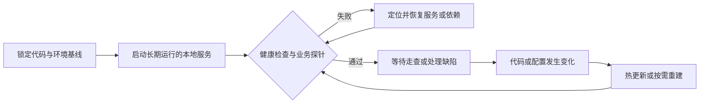

# Run Local Debug Loop

把功能主体完成后的微调阶段变成可追踪的闭环：固定代码与环境基线，保持本地环境可用，连续收集问题，按影响排序，逐项复现、修复和验证。目标是让用户随时可以继续走查，并减少边看边改造成的遗漏，而不是扩展原需求。

## 开始前

1. 确认本轮范围、实际工作树、分支和提交号，不从相似目录或旧分支启动。
2. 读取项目自己的启动、数据库、DDL 和提交规则；优先使用项目已有启动脚本。
3. 说明前后端地址、当前账号角色以及后端连接的是本地数据还是共享环境。连接共享环境时，任何造数、作废、重启等有副作用动作都先取得授权。
4. 先做健康检查和一个最短业务请求，确认本地服务确实运行当前代码，而不是只看到端口已监听。

## 保持本地环境可用

“可用”至少同时满足：前端入口可访问、后端健康检查与最短业务探针通过、运行进程来自本轮确认的工作树和分支、必要外部依赖可连接。只看到端口或进程存在不能判定为可用。

- 前后端使用可持续观察的后台进程或终端会话启动，并保留端口、进程或会话标识、日志位置和启动命令，避免每次从头寻找。
- 进入每轮 Debug、准备让用户点击页面、以及重建或重启之后，都先做一次轻量存活检查；不设置无意义的高频轮询。
- 发现服务退出或当前代码与运行基线不一致时，优先恢复环境，再继续分析页面问题；探针未通过时不得声称“本地可用”。
- 调试窗口尚未结束时，不主动停止可继续使用的本地服务。只有用户要求停止、端口冲突、资源风险或项目规则要求时才关闭，并明确告知当前不可用状态。
- “随时可用”限于当前调试窗口和本机仍在运行的条件，不承诺跨电脑重启、休眠、网络中断或执行环境回收后永久驻留；恢复后重新验证即可。

## 缺陷队列

收到反馈时先登记再修复。一条消息包含多个独立现象时拆成多个问题；同一根因的重复表现可以合并，但保留受影响页面。

最小字段包括：

- 编号、页面或场景、现象、预期结果；
- 优先级、当前状态、是否阻塞验收；
- 复现证据、修复位置或提交号、验证人和验证日期。

若用户授权维护项目缺陷台账，则写入该台账；否则只在当前对话中维护临时队列，不擅自创建文件。

优先级按影响判断：

- `P0`：主流程不可用、报错或数据错误；
- `P1`：可以绕过，但明显影响使用或理解；
- `P2`：展示、文案和一致性问题；
- `P3`：非当前验收所需的增强。

同级内先处理阻塞其它验证的项，再合并同一页面或同一根因的修改，避免频繁切换。

## 单项闭环

每个问题依次完成：

1. 用用户给出的账号、数据和入口复现；无法复现时记录缺少的条件，不猜原因。
2. 定位最小根因，检查是否影响同类页面或既有功能。
3. 实施最小修复，不借 Debug 阶段顺带重构或扩大范围。
4. 先验证最接近修改点的接口或组件，再运行受影响模块的测试、编译或构建。
5. 将状态改为“已修，待用户验证”。人工页面问题只有用户确认后才能标记“已验证”。

用户正在连续报问题时，默认只登记并简短确认；用户明确说“开始修复”或“统一整理”后，再批量排序和处理。

## 高风险边界

- DDL、共享数据库造数、重启他人使用的服务、合并和推送分别遵循项目规则及本次授权，不因进入 Debug 模式自动获得权限。
- DDL 与代码强依赖时，先完成数据库变更再启动引用新结构的代码；不能执行时明确阻塞点。
- 产品语义存在两种合理解释且会导致不同实现时，只提出一个最小决策问题。
- 不用已有自动化测试替代本轮真实页面验证，也不把“代码已改”写成“问题已关闭”。

## 收口

队列为空或只剩外部阻塞项时，输出：已验证项、待用户验证项、阻塞项、遗留增强、当前运行基线和本地服务可用状态。是否合并、发布或结束 Debug 模式由用户决定。
