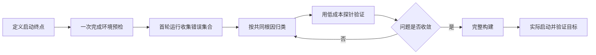

# Start Unfamiliar Project Fast

目标是尽快得到第一个可观察结果，例如健康检查通过、服务端口可访问、模拟器启动或首个页面出现。启动阶段不追求先理解全部源码，也不把所有历史问题顺手修完。

## 先定义启动终点

用一句话确定本次什么叫“已启动”，例如依赖恢复并编译通过、前后端可登录、模拟器或真机进入指定页面。未完成的层次准确写“未验证”，不能用编译成功代替启动成功。

区分“只诊断”和“允许修复”。用户只要求启动或验收时，可以处理可逆的本地环境问题；若必须修改业务源码、升级依赖或改变共享环境，先说明原因并取得相应授权。

## 快速启动顺序

### 1. 一次做完预检

首次完整构建前集中检查：

- 实际工作目录、分支、提交和未提交改动；
- 项目声明的运行时、SDK、包管理器和锁文件版本；
- 环境变量、配置文件、代理、端口和外部服务；
- 依赖缓存、代码生成物、二进制架构或平台切片；
- 项目已有的 README、启动脚本和本地规则。

预检只收集事实，不擅自修改全局工具链。项目已有脚本能完成检查时优先复用。

### 2. 第一次运行用于收集错误

第一次构建或启动不是为了看到第一个错误就停，而是尽量得到完整错误集合：

- 工具支持时启用“出错后继续”；
- 保留完整日志，将问题归为环境、依赖、生成物、构建配置、二进制兼容和源码兼容；
- 先处理能消除最多下游报错的上游根因，不按日志出现顺序逐条修。

### 3. 同类问题一次查全

定位到一个失败对象后，先搜索全部引用、同类文件和相关配置，再统一处理。一个依赖同时涉及声明、签名、调试符号和工程引用，就一次检查完整；同一过时 API 出现多次，就先全局定位，不只修当前报错行。

### 4. 用最低成本探针验证

验证成本从低到高：

1. 文件、版本、锁文件和配置文本检查；
2. 工具提供的配置查询、依赖解析或静态诊断；
3. 单模块、单 target、单架构或最小示例；
4. 增量构建；
5. 完整构建；
6. 实际启动并验证目标页面或请求。

如果数秒钟的配置查询就能证明设置没有生效，不要用数分钟的完整构建验证同一假设。低成本检查收敛后，再进行全量构建。

### 5. 并行独立长任务

预计超过 30 秒、且结果不影响下一步判断的任务可以并行。例如下载依赖时检查工程配置，预缓存运行时制品时检查锁文件。存在明确依赖关系的步骤保持串行。

### 6. 典型错误先查已知解

错误文本明显属于工具链或 SDK 的典型问题时，先检查项目已有记录、官方文档和上游 issue，尝试低风险、可撤销且与当前版本匹配的解法；不成立再深入工具源码。采用已知解后仍要用最小探针证明它适用于当前项目。

## 避免这些慢动作

- 不做预检，环境问题一路撞一个发现一个；
- 每发现一个错误就修改一次、完整构建一次；
- 配置是否生效也靠整包编译猜；
- 典型报错不检索，直接阅读工具源码从零推导；
- 下载、预缓存、构建等长任务全部串行等待；
- 启动过程中扩大范围，顺手升级依赖或重构工程；
- 过程更新过长，让用户看不出当前卡点。

## 沟通与收口

进行中只报告：当前卡点、正在验证的假设、下一步。完整日志和推导留到最终报告。

结束时先说明是否达到启动终点，再简要列出环境问题、项目自身问题、已实施修复、验证证据和未验证项。经过实际验证、能避免下次重复排查的结论，应写回当前项目的 README、启动脚本或预检脚本，而不是只留在一次对话里。
