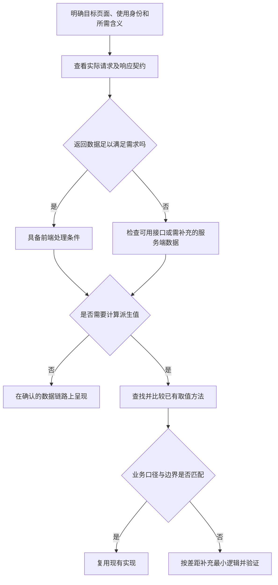

# 按数据链路决定改动落点

处理“这里显示一个字段”“取最近一次结果”“这个只改前端就行”等需求时，先核验目标端能拿到什么，再判断已有逻辑能否按相同口径给出所需值。系统中有数据，不代表目标页面已能使用；一段计算很短，也不代表它的业务含义简单。

## 按真实调用路径判断

接口核验落到目标端实际使用的请求、返回字段和调用身份。管理端能查到某字段，不能证明另一个页面或未登录用户也能取得它；同时有多个入口时，只读到其中一个响应也不足以确定改动范围。

响应已包含字段，或已有数据足以按正确口径计算时，可以只改前端。数据不足时，应明确缺口在哪一层，再选择已有可用接口或扩展契约；不能为少改后端就让目标端调用不适合其权限的接口。

## 派生值先找已有口径

“最新一次”“合计”“当前有效”往往隐含筛选、排序和反向事件处理。检索已有调用者与实现，核对它算的是否正是本次所需含义，再决定调用、扩展或单独实现。

- **撤销会改变有效性**：记录依次为“确认、撤销”。只取最后一条确认记录，会错误显示仍已确认。已有方法可能处理这条边界，也可能没有，需看实现或验证结果。
- **列表位置不等于业务顺序**：取末项依赖排序契约，分页还可能漏掉所需记录。即使显式取最大时间，也不能替代“当前有效”的业务判断。
- **共享实现有助于保持口径一致**：优先调用已有同语义方法；跨层不能直接调用时，评估在数据提供方复用并返回结果，避免多个页面各维护一套算法。

越是快速处理线上问题，越应优先寻找已验证的同语义实现：赶时间意味着更少机会验证新算法，现场另写一段看似简单的计算容易漏掉已知边界。查找应围绕实际调用链和相邻用法，不扩展成全库重构；已有方法口径不符时，不能为了复用而带入错误语义。

## 给出可核验的落点

用简短说明交代：目标端实际拿到什么、缺少什么、复用哪个实现及其适用依据、最终改动哪些层。对影响结论的风险做针对性验证，例如真实响应、撤销后的结果或排序变化；数据已可达且只是展示调整时，不强制补一套复杂流程。
