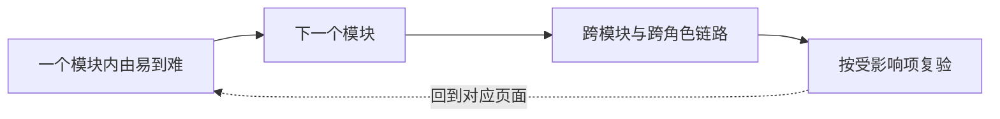

# Track Manual UI Acceptance

清单是可暂停、可继续的页面导航与验收记录，不是另一份测试方案。优先减少用户切换模块、寻找入口和填写表格的成本。

## 建立真实基线

确认本轮范围、运行代码与环境、账号和必要数据。页面入口来自实际路由和菜单配置，不从组件目录猜 URL；无法验证的动态详情链接改写为最短进入路径。

代码变化时标明哪些已验页面需要复看，不将旧基线下的通过自动算成新版本通过。

## 按模块走，不在模块间跳

单页面检查先按用户看到的业务模块分组，组内依次检查：只读列表与详情 → 新增编辑及校验 → 配置保存与回显 → 发布或角色办理。跨页面、跨角色场景另列，覆盖正常链路及关键异常。

排序服务实际操作，允许绕过不影响其他项的阻塞。不要为全局难度排序而让用户反复换菜单。

## 最小清单

| 人工状态 | 页面或场景 | 直达入口或最短路径 | 最小检查点 |
| --- | --- | --- | --- |
|  | 示例详情页 | 列表 → 详情 | 信息完整；只读内容不可编辑 |

- 人工状态只填 `✅通过` / `🔴不通过`，未查留空。问题详情留在已有缺陷台账，不增加手填长描述区。
- 账号/数据、问题编号、日期仅在有实际记录需求时加；行序已有排序含义，不默认再加“顺序”列。
- 用户要求 AI 走查时增加独立一列，标明通过、不通过或未验证及必要原因；加列本身不授权执行走查。AI 结果不代填人工状态。
- 检查点差异过大就拆行，避免一个勾选代表半通过半失败。

## 执行与复验

连续收到问题时先记录，按用户要求统一修复，不每报一项就打断验收。修复后提示人工复验；只有用户确认才能更新人工结论。

已有人工通过但代码又改动时，保留原结果及其基线，在受影响行标出“待复验”，不悄悄改成已失败或仍然有效。汇总从逐行记录计算，不维护另一套手写数字；未复验项单独列出，不能据旧通过宣称当前版本全部通过。

清单放在实施与验证记录中，不进入设计基线。页面验收也不替代接口权限、事务和自动化回归。
