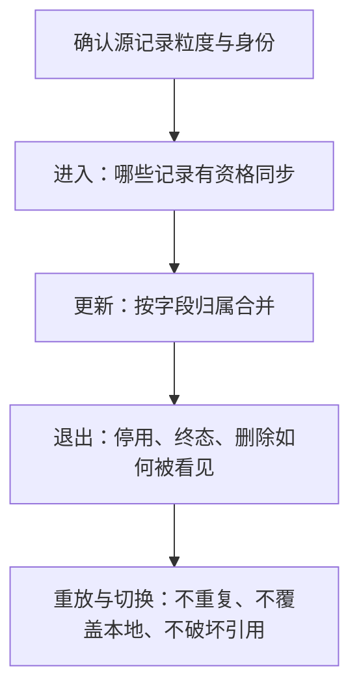

# Verify Data Sync Contract

同步改造首先要证明“还是正确的那些记录，且没有破坏本地维护和既有引用”，不只是新字段能取到值。沿当前链路核验，不先重建一套同步框架。

## 先确定一行是谁

跟踪一条真实记录：源接口一行 → 本地唯一键 → 下游引用。分别说明业务单号、稳定内部标识、明细序号和展示名称的作用。

换接口时特别检查表头与明细粒度、一对多关系、组织范围及原筛选条件。两边行数相等不证明集合相同；应按确认的身份键比较漏项、额外项、重复及关键值，区分预期扩展与意外差异，不强求新旧集合完全相等。序号只有在源系统保证稳定时才适合作身份，不能仅因当前样本不重复就定为稳定键。

## 再核三条路径

**进入**：比较定时、手动、实时消息和补发入口的范围。条件不满足时，是延后等待补齐、明确跳过，还是报错？条件后来满足后，是否有路径重新送达？

**更新**：以字段区分上游负责、本地负责和派生值。可两边修改的字段需要明确覆盖或冲突口径，而不是整行更新。一次按键批量加载的数据尽量复用于存在性校验、合并和审计，避免逐字段重复查询；并发保护仍应在同一写入边界内成立。

**退出**：只拉“有效记录”会看不到后来失效的记录；本次没返回也不等于删除。按已有能力选择状态变更事件、取消过滤的增量查询或周期对账。若本期没有退出传播，明示后果，不声称目标端是完整镜像。

## 用最小反例核验契约

按本次变化选择样本，不要求穷举：

| 改动 | 最有区分力的样本或断言 |
| --- | --- |
| 源接口或主键切换 | 同一单据多明细、同编码不同组织、已有下游引用；比较身份集合而非只比总数 |
| 增量拉取 | 同时间戳多条、窗口边界、一次重放，以及状态改变是否真的推进增量标记 |
| 字段合并 | 本地改过备注后再次同步；缺字段、显式空值和空白字符串按契约分别处理 |
| 停用或删除 | 原来已同步的记录退出筛选范围后，目标端能否按约定失效或保留 |

样本结论注明环境、接口版本与取数方式。备份库、迁移遗留数据或单次查询可以提出疑点，不能单独证明在线接口的长期行为；关键分歧用实际接口探针或接口方明确契约收口。

## 切换而不割断旧链路

现有功能改造前确认哪些身份必须延续：数据键、消费者调用、菜单入口和权限标识。旧页面被替换，不代表它调用的服务没有其他消费者。存量自由文本无法可靠对应新主数据时，列出待映射项，不以重跑回填脚本代替确认映射。

交付只需给出当前映射与字段归属、影响范围、关键样本结果和未闭合项。若记录身份或写入所有权未定，先阻塞这部分切换；展示文案等可逆细节不阻塞已明确的部分。
